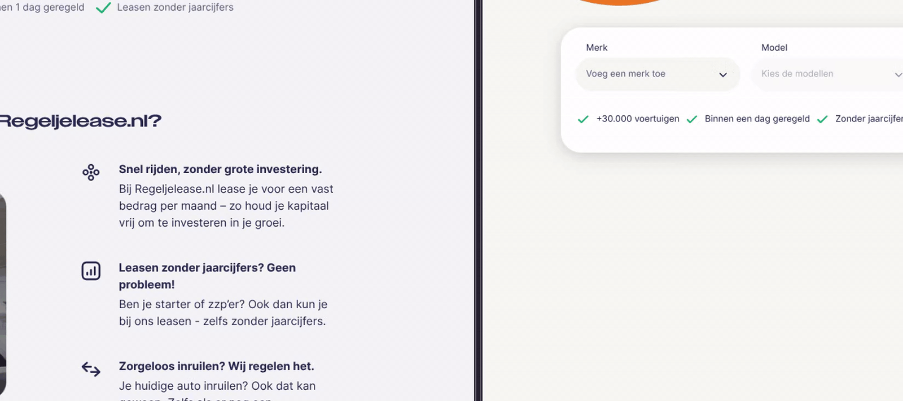

# Regeljelease — Front-end Assessment

The assessment requirements:
1)
- Got handed a Figma design (w/o dev access so no exports sadly)
- Build the design as far u want (consisted of nav, hero, filter, mobile variant)
- Make sure it's responsive and matches

2)
- Got handed a server.js which was a part of their api to not have to deal with CORS.
- Use this api to build the filters
  - If a filter changes, make sure the other filters update accordingly.

## What I did

### Setup
- Scaffolded a next app through `bunx create-next-app@latest` /w tailwind, react compiler.
- Decided on not installing any ui library as the only tricky component is a select dropdown, which if I werent frontend engineer I could just render <select> <options>. For a PoC like this I dont bother with building DRY <Button>, <Input> etc.
- Build entire front-end statically except for menu dropdowns and mobile menu.

- ^ satisfied, thus moved over to the integration of the api.

### Retrieving data from the api

- Migrated the given `server.js` into Next.js's serverless architecture by creating an endpoint at `/api/home`.

- Utilizied SSR to fetch the initial data and client-side for updating reactively. 
   - SSR: cached for 60 seconds.
   - Client-side: cache: 'no-store', updates reactively.

- Integrated an inline "ghost text" autocomplete to the keyword search.

### Rendering ui
 So far the project utilized zero external libraries so I opted for building my own select dropdown. Normally I use baseui or radix ui.
 
 Select dropdown renders initial data -> user opens it -> clicks an option -> other option which aren't relevant get filtered out and search $QTY results update accordingly.

 With a custom select comes a lot of -headaches-, things you would not think about resulting in quite some time but result speaks for itself.

#### Accessibility
A select MUST be keyboard accessible. Which means a lot of keyboard events, so I opted to dogfood my own library, `@remcostoeten/use-shortcut`. [GitHub](https://github.com/remcostoeten/use-shortcut) / [Advanced demo showcase](https://use-shortcut.vercel.app)

- Tabbing into the select opens it, escape closes it, arrow down/up navigates options, enter selects the option. Once an option is selected it automatically focuses on the next available filter.
- When re-opening the select it focuses on the previously selected option in the long list of options (if applicable).
- The more filters arer applied the fewer results are possible, making it possible to give the user a suggestion on what to search or in the latest query field (for prod: could be optimized with machine learning, ai, or simply sorted in a certain way which would increase conversion or generating more income due to having a deal with a certain car brand that will get previewed on top if there would be two brands with the same results instead of showing them alphabetically or w/e sorting order).
- A selected filter gets a pill style indicator which can be clicked to remove or simply tab with the keyboard which navigates your focus to the next/previous logical filter based on new results due to cancellation of previous filters.
- **Advanced Select Capabilities**:
  - Native-feeling type-ahead support (e.g. typing "Au" instantly jumps to "Audi").
  - **Combobox search**: For filters with long lists (>8 items like "Models"), a sticky inline search field automatically appears, and is auto-focused when opened via keyboard for rapid filtering.

Was this needed for this assessment? Prob not. Could I have used a library? Prob yes. But I find it fun, and learn.

- As there was no response design I just used my [own component](https://github.com/remcostoeten/react-beautiful-featurerich-codeblock) to get feedback, not really part of the assessment. Without that component we could've been package free.

Furthermore architecture wise I like separation of concerns, I don't use comments useless core/business logic or some jsdoc/docstring, dozens of comments throughout the codebase is usually an indicator of 
 a codebase that is hard to understand, or bad design IMO.

 I quite often use a feature/sliced/domain/module driven architecture with a shared directory for  things that are used more than once. Separation of concerns in this project might seem extreme but that is just because it's small.

 For bigger react/next examples just view my recent projects on [GitHub](https://github.com/remcostoeten?tab=repositories)